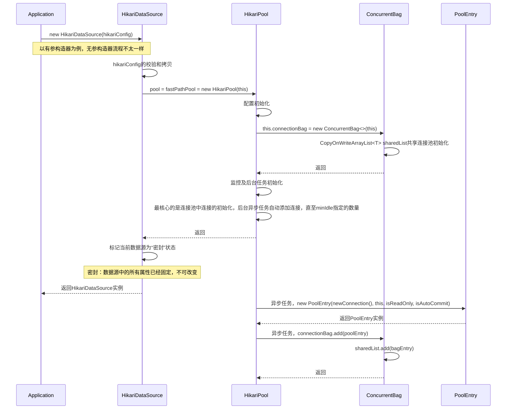
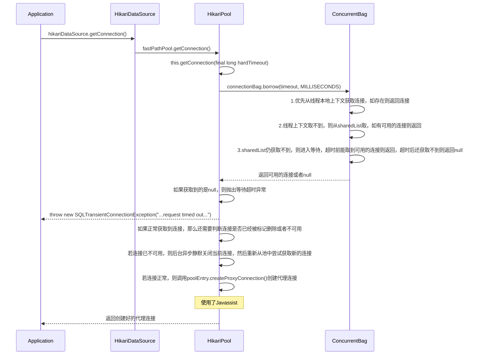
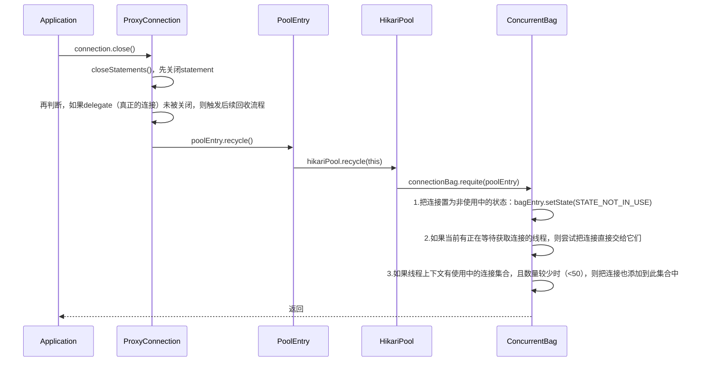

# 前言

大名鼎鼎的数据库连接池框架[HikariCP](https://github.com/brettwooldridge/HikariCP)，以其可靠性、超轻量、高性能而闻名。官方对于如何做到这几点有较为详细的介绍☞[Down-the-Rabbit-Hole](https://github.com/brettwooldridge/HikariCP/wiki/Down-the-Rabbit-Hole)。本文尝试从核心源码的角度来探究其中奥秘。

# 配置

首先，针对连接池的一些最常用的核心配置项官方有详细的介绍，我们先来简单过一下：

- **autoCommit**：数据库连接的自动提交属性，默认为true。

  > ✅`autoCommit`
  > This property controls the default auto-commit behavior of connections returned from the pool. It is a boolean value. *Default: true*

- **connectionTimeout**：连接超时时间，默认30000（单位：ms），可设置的最小值为 250 ms。它控制的是客户端从连接池中取连接时的最大等待超时时间，超过此时间仍未返回可用的连接，则抛出SQLException。

  > ⏳`connectionTimeout`
  > This property controls the maximum number of milliseconds that a client (that's you) will wait for a connection from the pool. If this time is exceeded without a connection becoming available, a SQLException will be thrown. Lowest acceptable connection timeout is 250 ms. *Default: 30000 (30 seconds)*

- **idleTimeout**：空闲连接的超时时间，默认600000ms（10min），正常可配置的最小值为10000ms（10s）。当值为0时表示空闲连接永不移除。它用于控制连接池中连接的最大空闲时长。**此配置只在最小空闲连接数的配置值小于最大连接数的配置值时生效**。当池中的连接数已经达到最小空闲连接数时，空闲的连接将不再被停用。连接是否因空闲而被停用的最大变化时间为+30s，平均变化时间为+15s。在超时之前，连接不会因空闲而被停用。

  > ⏳`idleTimeout`
  > This property controls the maximum amount of time that a connection is allowed to sit idle in the pool. **This setting only applies when `minimumIdle` is defined to be less than `maximumPoolSize`.** Idle connections will *not* be retired once the pool reaches `minimumIdle` connections. Whether a connection is retired as idle or not is subject to a maximum variation of +30 seconds, and average variation of +15 seconds. A connection will never be retired as idle *before* this timeout. A value of 0 means that idle connections are never removed from the pool. The minimum allowed value is 10000ms (10 seconds). *Default: 600000 (10 minutes)*

- **keepaliveTime**：连接的保活时长，默认值为0（代表禁用），正常可配置的最小值为30000ms（30s），更推荐以分钟的粒度来设置。它用来控制HikariCP间隔多久去维持一个连接的活性，以防其被数据库或者基础网络设施层置为超时。此配置的值必须小于最大存活时长的值。“保活”只存在于空闲连接当中。当针对某个连接的“保活”时间来临时，当前连接会从池中被移除，然后进行“ping”操作，之后再返还回池中去。“ping”操作指以下任意一种：执行JDBC4的isValid()方法，或者执行connectionTestQuery配置的语句。一般情况下，连接离开池子的时间间隔是以几毫秒甚至是亚毫秒来计量，所以对性能的影响微乎其微。

  > ⏳`keepaliveTime`
  > This property controls how frequently HikariCP will attempt to keep a connection alive, in order to prevent it from being timed out by the database or network infrastructure. This value must be less than the `maxLifetime` value. A "keepalive" will only occur on an idle connection. When the time arrives for a "keepalive" against a given connection, that connection will be removed from the pool, "pinged", and then returned to the pool. The 'ping' is one of either: invocation of the JDBC4 `isValid()` method, or execution of the `connectionTestQuery`. Typically, the duration out-of-the-pool should be measured in single digit milliseconds or even sub-millisecond, and therefore should have little or no noticeable performance impact. The minimum allowed value is 30000ms (30 seconds), but a value in the range of minutes is most desirable. *Default: 0 (disabled)*

- **maxLifetime**：用于控制连接的最大存活时长，默认值为1800000（30min），正常可配置的最小值为30000ms（30s）。当值为0时，代表没有最大存活时长（即无限存活时长），当然取决于idleTimeout的设置。正在使用中的连接永不会被停用，只有当它关闭后才会被移除。对于每个连接，均对其最大存活时长进行了轻微的负衰减来避免池中连接的大规模消亡。**强烈建议设置此值，而且它应该要比任何数据库或者基础设施的强制超时限制要小几秒钟**。

  > ⏳`maxLifetime`
  > This property controls the maximum lifetime of a connection in the pool. An in-use connection will never be retired, only when it is closed will it then be removed. On a connection-by-connection basis, minor negative attenuation is applied to avoid mass-extinction in the pool. **We strongly recommend setting this value, and it should be several seconds shorter than any database or infrastructure imposed connection time limit.** A value of 0 indicates no maximum lifetime (infinite lifetime), subject of course to the `idleTimeout` setting. The minimum allowed value is 30000ms (30 seconds). *Default: 1800000 (30 minutes)*

- **connectionTestQuery**：连接测试语句，默认为空。**如果应用的数据库驱动支持JDBC4，那么强烈建议无需关注此配置项**。它是为那些不支持JDBC4的Connection.isValid()接口的驱动而“遗留”下来的配置。该语句会在客户端从池中获取连接时执行，用以验证获取到的连接是否能正常与数据库通信。当然，如果运行中的连接池未配置此项且驱动不支持JDBC4的情况下，HikariCP会打印错误日志告警。

  > 🔤`connectionTestQuery`
  > **If your driver supports JDBC4 we strongly recommend not setting this property.** This is for "legacy" drivers that do not support the JDBC4 `Connection.isValid() API`. This is the query that will be executed just before a connection is given to you from the pool to validate that the connection to the database is still alive. *Again, try running the pool without this property, HikariCP will log an error if your driver is not JDBC4 compliant to let you know.* *Default: none*

- **minimumIdle**：最小空闲连接数，默认值等于最大连接数。它用于控制HikariCP在连接池中可维护的最小空闲连接数。如果空闲连接数低于此值且池中总连接数小于最大连接数，那么HikariCP会尽最大努力快速有效地新增额外的连接。但是，为了最好的性能以及对突发流量的最佳应对，官方推荐无需配置此项，而是让HikariCP充当固定大小的连接池。

  > 🔢`minimumIdle`
  > This property controls the minimum number of *idle connections* that HikariCP tries to maintain in the pool. If the idle connections dip below this value and total connections in the pool are less than `maximumPoolSize`, HikariCP will make a best effort to add additional connections quickly and efficiently. However, for maximum performance and responsiveness to spike demands, we recommend *not* setting this value and instead allowing HikariCP to act as a *fixed size* connection pool. *Default: same as maximumPoolSize*

- **maximumPoolSize**：最大连接数，默认值10。它控制着连接池中允许创建的最大连接数，包括空闲连接和使用中的连接。基本上此值会决定与数据库后端的实际最大连接数。最好是由客户端的执行环境来决定一个合理的值。当池中的连接数达到此大小且无空闲连接可用时，对getConnection()方法的调用将会阻塞，直至connectionTimeout（独立的配置项，默认30s）毫秒后超时。

  > 🔢`maximumPoolSize`
  > This property controls the maximum size that the pool is allowed to reach, including both idle and in-use connections. Basically this value will determine the maximum number of actual connections to the database backend. A reasonable value for this is best determined by your execution environment. When the pool reaches this size, and no idle connections are available, calls to getConnection() will block for up to `connectionTimeout` milliseconds before timing out. Please read [about pool sizing](https://github.com/brettwooldridge/HikariCP/wiki/About-Pool-Sizing). *Default: 10*

- **metricRegistry**：监控指标注册表，默认空。该配置项只能通过程序配置或者在IoC容器中使用。它允许我们为连接池指定一个Codahale/Dropwizard MetricRegistry的实例，用于记录各种指标。

  > 📈`metricRegistry`
  > This property is only available via programmatic configuration or IoC container. This property allows you to specify an instance of a *Codahale/Dropwizard* `MetricRegistry` to be used by the pool to record various metrics. See the [Metrics](https://github.com/brettwooldridge/HikariCP/wiki/Dropwizard-Metrics) wiki page for details. *Default: none*

- **healthCheckRegistry**：健康检查注册表，默认空。该配置项只能通过程序配置或者在IoC容器中使用。它允许我们为连接池指定一个Codahale/Dropwizard HealthCheckRegistry的实例，用于上报当前连接池的健康状况。

  > 📈`healthCheckRegistry`
  > This property is only available via programmatic configuration or IoC container. This property allows you to specify an instance of a *Codahale/Dropwizard* `HealthCheckRegistry` to be used by the pool to report current health information. See the [Health Checks](https://github.com/brettwooldridge/HikariCP/wiki/Dropwizard-HealthChecks) wiki page for details. *Default: none*

- **poolName**：连接池名称，默认会自动生成。它代表用户为连接池指定的名称，主要出现在日志或者JMX管理控制台中，用来区别连接池及其配置。

  > 🔤`poolName`
  > This property represents a user-defined name for the connection pool and appears mainly in logging and JMX management consoles to identify pools and pool configurations. *Default: auto-generated*

# 流程

主要整理了以下三个操作对应的时序图：数据源的初始化、数据库连接的获取、数据库连接的回收。

## 数据源初始化



## 获取数据库连接



## 回收数据库连接



# 源码

这里分析的源码版本为 ***5.1.0***，主要是上述时序图中的所涉及到的核心类及一些关联类中的重点属性和方法，并非所有的源码。

## HikariDataSource

关键逻辑：

- 有参/无参构造器的初始化流程
- 获取连接
- 数据源的关闭

```java
// HikariDataSource本身也是一个HikariConfig
public class HikariDataSource extends HikariConfig implements DataSource, Closeable
{
    // 标识数据源是否已关闭
    private final AtomicBoolean isShutdown = new AtomicBoolean();

    // 连接池，有两个引用，不同的初始化逻辑有不同的指向
    private final HikariPool fastPathPool;
    private volatile HikariPool pool;
    
    // 默认无参构造器，会使用默认的连接池参数。此时连接池（pool，而非fastPathPool）会延迟初始化，在调用getConnection()方法时
    public HikariDataSource()
    {
        fastPathPool = null;
    }
    
    // 指定参数构造器
    public HikariDataSource(HikariConfig configuration)
    {
        // 自定义配置的校验和拷贝
        configuration.validate();
        // 这里会拷贝配置而不是直接使用入参的configuration类，其实是一种保护，避免入参的configuration在后续被改动，导致连接池异常
        // 从下面的seal()方法也可以倒推
        configuration.copyStateTo(this);

        LOGGER.info("{} - Starting...", configuration.getPoolName());
        // 初始化时客户端指定了自定义配置，则pool = fastPathPool，都指向以指定配置生成的连接池
        pool = fastPathPool = new HikariPool(this);
        LOGGER.info("{} - Start completed.", configuration.getPoolName());
        // this.sealed = true，标识当前数据源是“密封”的，也就是初始化后就无法再修改其各种配置项
        // 在HikariConfig的各种set方法中，都有对此属性值的检测，为true则无法再set
        this.seal();
    }
    
    @Override
    public Connection getConnection() throws SQLException
    {
        if (isClosed()) {
            throw new SQLException("HikariDataSource " + this + " has been closed.");
        }

        // 优先从fastPathPool中获取连接
        if (fastPathPool != null) {
            return fastPathPool.getConnection();
        }

        // See http://en.wikipedia.org/wiki/Double-checked_locking#Usage_in_Java
        // 默认配置下的连接池的延迟初始化，双重检测锁保证连接池的单例
        HikariPool result = pool;
        if (result == null) {
            synchronized (this) {
                result = pool;
                if (result == null) {
                    validate();
                    LOGGER.info("{} - Starting...", getPoolName());
                    try {
                        pool = result = new HikariPool(this);
                        // 一样的会“密封”当前连接池
                        this.seal();
                    }
                    catch (PoolInitializationException pie) {
                        if (pie.getCause() instanceof SQLException) {
                            throw (SQLException) pie.getCause();
                        }
                        else {
                            throw pie;
                        }
                    }
                    LOGGER.info("{} - Start completed.", getPoolName());
                }
            }
        }

        return result.getConnection();
    }
    
    @Override
    public void close()
    {
        // 若数据源未关闭，则isShutdown置为true后执行后续逻辑。若已经关闭，则忽略
        if (isShutdown.getAndSet(true)) {
            return;
        }

        var p = pool;
        if (p != null) {
            try {
                LOGGER.info("{} - Shutdown initiated...", getPoolName());
                // 关闭数据源对应的连接池
                p.shutdown();
                LOGGER.info("{} - Shutdown completed.", getPoolName());
            }
            catch (InterruptedException e) {
                LOGGER.warn("{} - Interrupted during closing", getPoolName(), e);
                Thread.currentThread().interrupt();
            }
        }
    }
}
```


## HikariPool

关键逻辑：

- 连接池的初始化，包括后台任务异步向池中添加连接的过程
- 连接池的状态变化：正常、挂起（默认是没有此状态的，需要主动启用）、关闭，及对应池中连接的处理流程
- 连接的获取和回收
- 各种后台任务的维护逻辑：核心连接数量的维持、连接到期后的自动销毁、连接活性探测等

```java
// pool本身也实现了IBagStateListener，在ConcurrentBag中会触发通知
public final class HikariPool extends PoolBase implements HikariPoolMXBean, IBagStateListener
{
    // 连接池的几种状态：正常、挂起、关闭
    public static final int POOL_NORMAL = 0;
    public static final int POOL_SUSPENDED = 1;
    public static final int POOL_SHUTDOWN = 2;
    public volatile int poolState;
    
    // 运行期间，使用此任务来维持核心连接数
    private final PoolEntryCreator poolEntryCreator = new PoolEntryCreator();
    // 初始化时，使用此任务来创建连接
    private final PoolEntryCreator postFillPoolEntryCreator = new PoolEntryCreator("After adding ");
    // 添加连接的线程池
    private final ThreadPoolExecutor addConnectionExecutor;
    // 关闭连接的线程池
    private final ThreadPoolExecutor closeConnectionExecutor;
    // 真正存放连接的bag
    private final ConcurrentBag<PoolEntry> connectionBag;
    
    // 检测连接是否泄漏的任务创建工厂，泄漏是指连接被程序只借不还
    // HikariCP的检测实现是先指定一个时间阈值，连接从被借用开始，到超过这个阈值后仍未归还到池中，则认为可能是出现了连接泄漏
    // 对应实际的任务类是ProxyLeakTask，检测到可能的泄漏后，会打印warn日志
    private final ProxyLeakTaskFactory leakTaskFactory;
    // 如果允许连接池挂起，那么它可用于连接池的挂起和恢复，具体实现参看SuspendResumeLock类的解析
    private final SuspendResumeLock suspendResumeLock;
    // 核心连接数维持的线程池
    private final ScheduledExecutorService houseKeepingExecutorService;
    // 指向houseKeepingExecutorService的返回，在关闭连接池时用到
    private ScheduledFuture<?> houseKeeperTask;
    
    public HikariPool(final HikariConfig config)
    {
        super(config);

        this.connectionBag = new ConcurrentBag<>(this);
        // 默认不允许挂起，suspendResumeLock = SuspendResumeLock.FAUX_LOCK。FAUX_LOCK是一个假锁，空实现
        // 如果允许连接池挂起，那么可以使用此Lock用于连接池的挂起和恢复，它实际上是一个信号量
        this.suspendResumeLock = config.isAllowPoolSuspension() ? new SuspendResumeLock() : SuspendResumeLock.FAUX_LOCK;

        this.houseKeepingExecutorService = initializeHouseKeepingExecutorService();

        // 如果配置了initializationFailFast，会在初始化时进行数据库连接的检测，其实就是尝试创建一个连接，看是否能成功
        // 默认是开启的
        checkFailFast();

        // 接下来都是一些线程池及后台任务的初始化和启动
        ThreadFactory threadFactory = config.getThreadFactory();

        final int maxPoolSize = config.getMaximumPoolSize();
        LinkedBlockingQueue<Runnable> addConnectionQueue = new LinkedBlockingQueue<>(maxPoolSize);
        this.addConnectionExecutor = createThreadPoolExecutor(addConnectionQueue, poolName + " connection adder", threadFactory, new CustomDiscardPolicy());
        this.closeConnectionExecutor = createThreadPoolExecutor(maxPoolSize, poolName + " connection closer", threadFactory, new ThreadPoolExecutor.CallerRunsPolicy());
        
        this.leakTaskFactory = new ProxyLeakTaskFactory(config.getLeakDetectionThreshold(), houseKeepingExecutorService);

        this.houseKeeperTask = houseKeepingExecutorService.scheduleWithFixedDelay(new HouseKeeper(), 100L, housekeepingPeriodMs, MILLISECONDS);

        if (Boolean.getBoolean("com.zaxxer.hikari.blockUntilFilled") && config.getInitializationFailTimeout() > 1) {
            addConnectionExecutor.setMaximumPoolSize(Math.min(16, Runtime.getRuntime().availableProcessors()));
            addConnectionExecutor.setCorePoolSize(Math.min(16, Runtime.getRuntime().availableProcessors()));

            final long startTime = currentTime();
            while (elapsedMillis(startTime) < config.getInitializationFailTimeout() && getTotalConnections() < config.getMinimumIdle()) {
                quietlySleep(MILLISECONDS.toMillis(100));
            }

            addConnectionExecutor.setCorePoolSize(1);
            addConnectionExecutor.setMaximumPoolSize(1);
        }
    }
    
    // 获取连接，使用了默认的超时时间
    public Connection getConnection() throws SQLException
    {
        return getConnection(connectionTimeout);
    }

    // 获取连接，需指定超时时间
    public Connection getConnection(final long hardTimeout) throws SQLException
    {
        // 利用信号量，控制并发数
        // 如果允许连接池挂起，且当前连接池是挂起状态，那么此处是无法获取到信号量的，会根据配置决定阻塞直到获取到一个permit还是直接抛出异常
        suspendResumeLock.acquire();
        final var startTime = currentTime();

        try {
            var timeout = hardTimeout;
            do {
                // 从bag中获取连接，poolEntry封装，有等待超时时间
                var poolEntry = connectionBag.borrow(timeout, MILLISECONDS);
                if (poolEntry == null) {
                    break; // We timed out... break and throw exception
                }

                final var now = currentTime();
                // 获取到连接后，还要检查连接是否已被标记为删除或者是否已不可用（网络或数据库原因导致的不可用）
                if (poolEntry.isMarkedEvicted() || (elapsedMillis(poolEntry.lastAccessed, now) > aliveBypassWindowMs && isConnectionDead(poolEntry.connection))) {
                    // 如果连接已被标记为删除或已不可用，那就后台异步静默关闭它
                    closeConnection(poolEntry, poolEntry.isMarkedEvicted() ? EVICTED_CONNECTION_MESSAGE : DEAD_CONNECTION_MESSAGE);
                    timeout = hardTimeout - elapsedMillis(startTime);
                }
                else {
                    metricsTracker.recordBorrowStats(poolEntry, startTime);
                    // 连接可用，则为其创建代理并返回。可以看到，连接泄漏检测的任务也同时启动
                    // 这里每次都是新建代理连接对象。使用了Javassist动态生成代理类，速度更快、字节码更精简
                    return poolEntry.createProxyConnection(leakTaskFactory.schedule(poolEntry));
                }
            } while (timeout > 0L);

            metricsTracker.recordBorrowTimeoutStats(startTime);
            // 获取超时，抛出异常
            throw createTimeoutException(startTime);
        }
        catch (InterruptedException e) {
            Thread.currentThread().interrupt();
            throw new SQLException(poolName + " - Interrupted during connection acquisition", e);
        }
        finally {
            suspendResumeLock.release();
        }
    }
    
    // 关闭连接池、连接存储bag以及对应的任务线程池
    public synchronized void shutdown() throws InterruptedException
    {
        try {
            // 连接池状态置为关闭
            poolState = POOL_SHUTDOWN;

            if (addConnectionExecutor == null) { // pool never started
                return;
            }

            logPoolState("Before shutdown ");

            // 尝试取消核心连接数维持任务的继续执行，但正在执行中的任务会让它继续执行直至完毕后再取消
            if (houseKeeperTask != null) {
                houseKeeperTask.cancel(false);
                houseKeeperTask = null;
            }

            // 软删除空闲连接，此方法里还有判断逻辑，并不是直接关闭空闲连接，所以是soft
            // 这里先调用一次，个人认为是作一个预处理，先尽可能的把一些空闲的连接关闭，避免在关闭过程中连接又被重新使用导致后续的关闭流程拉长
            softEvictConnections();

            addConnectionExecutor.shutdown();
            if (!addConnectionExecutor.awaitTermination(getLoginTimeout(), SECONDS)) {
                logger.warn("Timed-out waiting for add connection executor to shutdown");
            }
            destroyHouseKeepingExecutorService();

            // 把bag置为closed
            connectionBag.close();

            final var assassinExecutor = createThreadPoolExecutor(config.getMaximumPoolSize(), poolName + " connection assassinator", config.getThreadFactory(), new ThreadPoolExecutor.CallerRunsPolicy());
            try {
                final var start = currentTime();
                // 这里会一直执行直到存储连接的bag中再无任何连接为止
                do {
	                // 尝试终止正在使用中的连接并关闭它
                    abortActiveConnections(assassinExecutor);
                    // 这里会再度调用此方法，因为上面的第一次调用可能无法把所有连接关闭
                    softEvictConnections();
                } while (getTotalConnections() > 0 && elapsedMillis(start) < SECONDS.toMillis(10));
            }
            finally {
                assassinExecutor.shutdown();
                if (!assassinExecutor.awaitTermination(10L, SECONDS)) {
                    logger.warn("Timed-out waiting for connection assassin to shutdown");
                }
            }

            shutdownNetworkTimeoutExecutor();
            closeConnectionExecutor.shutdown();
            if (!closeConnectionExecutor.awaitTermination(10L, SECONDS)) {
                logger.warn("Timed-out waiting for close connection executor to shutdown");
            }
        }
        finally {
            logPoolState("After shutdown ");
            handleMBeans(this, false);
            metricsTracker.close();
        }
    }
    
   // ***********************************************************************
   //                        IBagStateListener callback
   // ***********************************************************************

    @Override
    public void addBagItem(final int waiting)
    {
        // 当等待获取连接的线程较多时，可能池中的连接已经不太够了，会提交一个连接创建的任务，尝试去新增一个连接
        // 当然不一定会新增成功，因为还有连接池参数的约束
        // 这里的比较对象是addConnectionExecutor的等待队列的size，因为addBagItem方法还有后台线程在调用，如果等待队列中已有线程在等待创建连接且等待获取连接的线程较少时，那么就没有必要再次触发创建了，因为队列中的任务创建连接后就已经够用了
        if (waiting > addConnectionExecutor.getQueue().size())
            addConnectionExecutor.submit(poolEntryCreator);
    }
    
    // 遍历bag中的所有连接，尝试软删除空闲连接
    @Override
    public void softEvictConnections()
    {
        connectionBag.values().forEach(poolEntry -> softEvictConnection(poolEntry, "(connection evicted)", false /* not owner */));
    }

    // 挂起连接池
    @Override
    public synchronized void suspendPool()
    {
        if (suspendResumeLock == SuspendResumeLock.FAUX_LOCK) {
            throw new IllegalStateException(poolName + " - is not suspendable");
        }
        // 如果支持挂起，那么更新连接池的状态为POOL_SUSPENDED，且调用suspendResumeLock的suspend()方法
        else if (poolState != POOL_SUSPENDED) {
            suspendResumeLock.suspend();
            poolState = POOL_SUSPENDED;
        }
    }

    // 把连接池从挂起恢复到正常
    @Override
    public synchronized void resumePool()
    {
        if (poolState == POOL_SUSPENDED) {
            poolState = POOL_NORMAL;
            // 恢复后，需尝试向池中填充连接
            fillPool(false);
            // suspendResumeLock也需要恢复
            suspendResumeLock.resume();
        }
    }

    // ***********************************************************************
    //                           Package methods
    // ***********************************************************************

    /**
    * Recycle PoolEntry (add back to the pool)
    */
    // 回收连接
    @Override
    void recycle(final PoolEntry poolEntry)
    {
        metricsTracker.recordConnectionUsage(poolEntry);

        connectionBag.requite(poolEntry);
    }

    /**
    * Permanently close the real (underlying) connection (eat any exception).
    */
    // 后台静默，彻底关闭实际的数据库连接
    void closeConnection(final PoolEntry poolEntry, final String closureReason)
    {
        if (connectionBag.remove(poolEntry)) {
            final var connection = poolEntry.close();
            closeConnectionExecutor.execute(() -> {
                quietlyCloseConnection(connection, closureReason);
                if (poolState == POOL_NORMAL) {
                    fillPool(false);
                }
            });
        }
    }

    // ***********************************************************************
    //                           Private methods
    // ***********************************************************************

    // 创建连接
    private PoolEntry createPoolEntry()
    {
        try {
            // new PoolEntry(newConnection(), this, isReadOnly, isAutoCommit)
            final var poolEntry = newPoolEntry();

            final var maxLifetime = config.getMaxLifetime();
            if (maxLifetime > 0) {
                // variance up to 2.5% of the maxlifetime
                final var variance = maxLifetime > 10_000 ? ThreadLocalRandom.current().nextLong( maxLifetime / 40 ) : 0;
                // 此处会随机指定一个variance，连接实际的最大存活时间 = 配置的maxLifetime值 - variance。这样做的目的是防止同一时刻出现大面积的连接到期，导致连接池阻塞
                final var lifetime = maxLifetime - variance;
                poolEntry.setFutureEol(houseKeepingExecutorService.schedule(new MaxLifetimeTask(poolEntry), lifetime, MILLISECONDS));
            }

            final long keepaliveTime = config.getKeepaliveTime();
            if (keepaliveTime > 0) {
                // variance up to 10% of the heartbeat time
                final var variance = ThreadLocalRandom.current().nextLong(keepaliveTime / 10);
                // 同上
                final var heartbeatTime = keepaliveTime - variance;
                poolEntry.setKeepalive(houseKeepingExecutorService.scheduleWithFixedDelay(new KeepaliveTask(poolEntry), heartbeatTime, heartbeatTime, MILLISECONDS));
            }

            return poolEntry;
        }
        catch (ConnectionSetupException e) {
            if (poolState == POOL_NORMAL) { // we check POOL_NORMAL to avoid a flood of messages if shutdown() is running concurrently
                logger.error("{} - Error thrown while acquiring connection from data source", poolName, e.getCause());
                lastConnectionFailure.set(e);
            }
        }
        catch (Exception e) {
            if (poolState == POOL_NORMAL) { // we check POOL_NORMAL to avoid a flood of messages if shutdown() is running concurrently
                logger.debug("{} - Cannot acquire connection from data source", poolName, e);
            }
        }

        return null;
    }

    // 维持池中最小空闲连接数的任务最终调用的方法
    private synchronized void fillPool(final boolean isAfterAdd)
    {
        // 空闲连接数不够且总连接数未达到最大连接数时才允许添加
        final var idle = getIdleConnections();
        final var shouldAdd = getTotalConnections() < config.getMaximumPoolSize() && idle < config.getMinimumIdle();

        if (shouldAdd) {
            final var countToAdd = config.getMinimumIdle() - idle;
            for (int i = 0; i < countToAdd; i++)
                addConnectionExecutor.submit(isAfterAdd ? postFillPoolEntryCreator : poolEntryCreator);
        }
        else if (isAfterAdd) {
            logger.debug("{} - Fill pool skipped, pool has sufficient level or currently being filled.", poolName);
        }
    }

    // 尝试关闭正在使用中的连接
    private void abortActiveConnections(final ExecutorService assassinExecutor)
    {
        for (var poolEntry : connectionBag.values(STATE_IN_USE)) {
            Connection connection = poolEntry.close();
            try {
                connection.abort(assassinExecutor);
            }
            catch (Throwable e) {
                quietlyCloseConnection(connection, "(connection aborted during shutdown)");
            }
            finally {
                connectionBag.remove(poolEntry);
            }
        }
    }

    // 如果配置了initializationFailFast，会在初始化时进行数据库连接的检测，其实就是尝试创建一个连接，看是否能成功
    private void checkFailFast()
    {
        // initializationFailTimeout的默认值为1，所以检测是开启的
        final var initializationTimeout = config.getInitializationFailTimeout();
        if (initializationTimeout < 0) {
            return;
        }

        final var startTime = currentTime();
        // 尝试创建一个连接，如果成功则会添加此连接到池中，不会浪费。如果失败或者超过指定的初始化超时时长，则抛出异常
        do {
            final var poolEntry = createPoolEntry();
            if (poolEntry != null) {
                if (config.getMinimumIdle() > 0) {
                    connectionBag.add(poolEntry);
                    logger.info("{} - Added connection {}", poolName, poolEntry.connection);
                }
                else {
                    quietlyCloseConnection(poolEntry.close(), "(initialization check complete and minimumIdle is zero)");
                }

                return;
            }

            if (getLastConnectionFailure() instanceof ConnectionSetupException) {
                throwPoolInitializationException(getLastConnectionFailure().getCause());
            }

            quietlySleep(SECONDS.toMillis(1));
        } while (elapsedMillis(startTime) < initializationTimeout);

        if (initializationTimeout > 0) {
            throwPoolInitializationException(getLastConnectionFailure());
        }
    }
    
    // 软删除连接
    private boolean softEvictConnection(final PoolEntry poolEntry, final String reason, final boolean owner)
    {
        // 先把poolEntry标记为 evicted
        poolEntry.markEvicted();
        // 如果是owner，即应用的主动调用，则直接关闭连接。如果不是owner，则尝试把poolEntry的状态改为RESERVED保留状态。如果状态修改成功，才关闭连接
        if (owner || connectionBag.reserve(poolEntry)) {
            closeConnection(poolEntry, reason);
            return true;
        }

        return false;
    }
    
    // 连接池的状态，各项指标。可以学习一下PoolStats类的设计
    private PoolStats getPoolStats()
    {
        return new PoolStats(SECONDS.toMillis(1)) {
            @Override
            protected void update() {
                this.pendingThreads = HikariPool.this.getThreadsAwaitingConnection();
                this.idleConnections = HikariPool.this.getIdleConnections();
                this.totalConnections = HikariPool.this.getTotalConnections();
                this.activeConnections = HikariPool.this.getActiveConnections();
                this.maxConnections = config.getMaximumPoolSize();
                this.minConnections = config.getMinimumIdle();
            }
        };
    }
    
    // ***********************************************************************
    //                      Non-anonymous Inner-classes
    // ***********************************************************************
    
    // 连接创建器
    private final class PoolEntryCreator implements Callable<Boolean>
    {
        private final String loggingPrefix;

        PoolEntryCreator()
        {
            this(null);
        }

        PoolEntryCreator(String loggingPrefix)
        {
            this.loggingPrefix = loggingPrefix;
        }

        @Override
        public Boolean call()
        {
            var backoffMs = 10L;
            var added = false;
            try {
                // 是否该创建连接。允许创建的话，则创建一个新的连接并添加到connectionBag中，退出。如果创建连接失败，则会等待后持续重试
                while (shouldContinueCreating()) {
                    final var poolEntry = createPoolEntry();
                    if (poolEntry != null) {
                        added = true;
                        connectionBag.add(poolEntry);
                        logger.debug("{} - Added connection {}", poolName, poolEntry.connection);
                        quietlySleep(30L);
                        break;
                    } else {  // failed to get connection from db, sleep and retry
                        if (loggingPrefix != null && backoffMs % 50 == 0)
                            logger.debug("{} - Connection add failed, sleeping with backoff: {}ms", poolName, backoffMs);
                        quietlySleep(backoffMs);
                        // 失败重试间隔，初始为10ms，随后每次时长会翻倍，直至最大值5s，之后固定为5s间隔
                        backoffMs = Math.min(SECONDS.toMillis(5), backoffMs * 2);
                    }
                }
            }
            finally {
                if (added && loggingPrefix != null)
                    logPoolState(loggingPrefix);
                else
                    logPoolState("Connection not added, ");
            }

            // Pool is suspended, shutdown, or at max size
            return Boolean.FALSE;
        }

        // 是否该继续创建连接
        // 连接池状态正常 & 总连接数小于最大连接数 & (空闲连接数未达到配置的最小空闲连接数 || 等待的线程数量超过了当前池中的空闲连接数)，则允许
        private synchronized boolean shouldContinueCreating() {
            return poolState == POOL_NORMAL && getTotalConnections() < config.getMaximumPoolSize() &&
                (getIdleConnections() < config.getMinimumIdle() || connectionBag.getWaitingThreadCount() > getIdleConnections());
        }
    
    }

    // 核心连接数维持的任务
    private final class HouseKeeper implements Runnable
    {
        private volatile long previous = plusMillis(currentTime(), -housekeepingPeriodMs);
        @SuppressWarnings("AtomicFieldUpdaterNotStaticFinal")
        private final AtomicReferenceFieldUpdater<PoolBase, String> catalogUpdater = AtomicReferenceFieldUpdater.newUpdater(PoolBase.class, String.class, "catalog");

        @Override
        public void run()
        {
            try {
                // refresh values in case they changed via MBean
                // 先重置一些属性，防止通过MBean修改了它们
                connectionTimeout = config.getConnectionTimeout();
                validationTimeout = config.getValidationTimeout();
                leakTaskFactory.updateLeakDetectionThreshold(config.getLeakDetectionThreshold());

                if (config.getCatalog() != null && !config.getCatalog().equals(catalog)) {
                    catalogUpdater.set(HikariPool.this, config.getCatalog());
                }

                final var idleTimeout = config.getIdleTimeout();
                final var now = currentTime();

                // 时钟偏移的检测，允许一定的回拨，128ms
                // Detect retrograde time, allowing +128ms as per NTP spec.
                if (plusMillis(now, 128) < plusMillis(previous, housekeepingPeriodMs)) {
                 	// 如果检测到了时钟回拨，则打印告警日志，重置时钟，并尝试软删除池中的空闲连接。结束本次任务
                    logger.warn("{} - Retrograde clock change detected (housekeeper delta={}), soft-evicting connections from pool.", poolName, elapsedDisplayString(previous, now));
                    previous = now;
                    softEvictConnections();
                    return;
                }
                else if (now > plusMillis(previous, (3 * housekeepingPeriodMs) / 2)) {
                    // No point evicting for forward clock motion, this merely accelerates connection retirement anyway
                    // 正向的时钟跳跃，无需做任何操作，只打印告警日志
                    logger.warn("{} - Thread starvation or clock leap detected (housekeeper delta={}).", poolName, elapsedDisplayString(previous, now));
                }

                // previous时间指向当前任务运行的时间
                previous = now;

                // 如果 设置了空闲超时时间 & 最小空闲连接数<最大连接数，则尝试将超过最小空闲连接数的空闲连接关闭
                if (idleTimeout > 0L && config.getMinimumIdle() < config.getMaximumPoolSize()) {
                    logPoolState("Before cleanup ");
                    final var notInUse = connectionBag.values(STATE_NOT_IN_USE);
                    var maxToRemove = notInUse.size() - config.getMinimumIdle();
                    for (PoolEntry entry : notInUse) {
                        // 如果存在需要关闭的连接 & 距离连接最近一次被访问的时间已超过了空闲超时时间 & 连接成功的被置为REVERSED
                        // 那么关闭连接
                        if (maxToRemove > 0 && elapsedMillis(entry.lastAccessed, now) > idleTimeout && connectionBag.reserve(entry)) {
                            closeConnection(entry, "(connection has passed idleTimeout)");
                            maxToRemove--;
                        }
                    }
                    logPoolState("After cleanup  ");
                }
                else
                    logPoolState("Pool ");

                // 最后仍然要尝试新增连接，因为时钟回拨的情况下，后续的定时调度需要新增连接
                fillPool(true); // Try to maintain minimum connections
            }
            catch (Exception e) {
                logger.error("Unexpected exception in housekeeping task", e);
            }
        }
    }

    // 连接最大存活时长检测任务，是一个延时调度，触发后就直接尝试去关闭连接
    private final class MaxLifetimeTask implements Runnable
    {
        private final PoolEntry poolEntry;

        MaxLifetimeTask(final PoolEntry poolEntry)
        {
            this.poolEntry = poolEntry;
        }

        public void run()
        {
            // 这里对softEvictConnection()方法的调用与之前不同，会关注返回的结果
            if (softEvictConnection(poolEntry, "(connection has passed maxLifetime)", false /* not owner */)) {
                // 连接关闭成功后，会再尝试向池中新增连接，如果等待线程较多的话
                addBagItem(connectionBag.getWaitingThreadCount());
            }
        }
    }

    // 探活任务
    private final class KeepaliveTask implements Runnable
    {
        private final PoolEntry poolEntry;

        KeepaliveTask(final PoolEntry poolEntry)
        {
            this.poolEntry = poolEntry;
        }

        public void run()
        {
            // 尝试把空闲连接置为REVERSED
            if (connectionBag.reserve(poolEntry)) {
                // 判断连接是否可用
                if (isConnectionDead(poolEntry.connection)) {
                    // 如果连接已经不可用，则尝试关闭旧连接，再添加新的连接
                    softEvictConnection(poolEntry, DEAD_CONNECTION_MESSAGE, true);
                    addBagItem(connectionBag.getWaitingThreadCount());
                }
                else {
                    // 连接仍可用，则将连接重置为空闲状态
                    connectionBag.unreserve(poolEntry);
                    logger.debug("{} - keepalive: connection {} is alive", poolName, poolEntry.connection);
                }
            }
        }
    }
    
}
```


## SuspendResumeLock

一把“锁”，可用于连接池的挂起和恢复。

```java
/**
 * This class implements a lock that can be used to suspend and resume the pool.  It
 * also provides a faux implementation that is used when the feature is disabled that
 * hopefully gets fully "optimized away" by the JIT.
 */
public class SuspendResumeLock
{
    // 假锁，空实现
    public static final SuspendResumeLock FAUX_LOCK = new SuspendResumeLock(false) {
        @Override
        public void acquire() {}

        @Override
        public void release() {}

        @Override
        public void suspend() {}

        @Override
        public void resume() {}
    };

    // 实际上使用的是信号量来控制，默认最大容量（访问许可数量）为 10000
    private static final int MAX_PERMITS = 10000;
    private final Semaphore acquisitionSemaphore;

    public SuspendResumeLock()
    {
        this(true);
    }

    private SuspendResumeLock(final boolean createSemaphore)
    {
        // 如果需要，创建一个Semaphore对象，获取许可时，采用公平模式（公平 - 队列，先来后到，非公平 - 抢占式，直接尝试compareAndSet）
        acquisitionSemaphore = (createSemaphore ? new Semaphore(MAX_PERMITS, true) : null);
    }

    public void acquire() throws SQLException
    {
        // 尝试获取一个permit，抢占式
        if (acquisitionSemaphore.tryAcquire()) {
            return;
        }
        // 获取失败，根据配置决定是否要抛出异常
        else if (Boolean.getBoolean("com.zaxxer.hikari.throwIfSuspended")) {
            throw new SQLTransientException("The pool is currently suspended and configured to throw exceptions upon acquisition");
        }
        // 如果获取失败且无需抛出异常，则一直阻塞等待直至获取到一个permit。此处即是按公平模式等待
        acquisitionSemaphore.acquireUninterruptibly();
    }

    // 释放一个permit
    public void release()
    {
        acquisitionSemaphore.release();
    }

    // 连接池挂起时调用，可以看到实际上就是占用了所有的permits，这样应用获取连接时就会一直阻塞
    public void suspend()
    {
        acquisitionSemaphore.acquireUninterruptibly(MAX_PERMITS);
    }

    // 连接池恢复时调用，释放所有的permits
    public void resume()
    {
        acquisitionSemaphore.release(MAX_PERMITS);
    }
}
```


## ConcurrentBag

关键逻辑：

- 连接的状态 - 未使用、使用中、移除、保留，及状态转换
- 连接的实际存储方式，及新增、获取和归还

```java
public class ConcurrentBag<T extends IConcurrentBagEntry> implements AutoCloseable
{
    private static final Logger LOGGER = LoggerFactory.getLogger(ConcurrentBag.class);

    // 真正存储连接的共享list
    private final CopyOnWriteArrayList<T> sharedList;
    // 连接是否使用弱引用，它是指在线程上下文中存储连接时，是否要使用WeakReference来包装PoolEntry对象
    private final boolean weakThreadLocals;
    // 线程上下文中存储连接的list。注意ThreadLocal是非static final的
    // sharedList已经是线程安全且CopyOnWriteArrayList的读也是很快的，这里为何还需要threadList？个人理解这既是为了更快，也是一种资源倾斜
    // 考虑一种场景：如果一个线程需要频繁地开启和关闭连接（比如在循环中，甚至是嵌套循环），那么从sharedList中取数，每次取到的连接可能会不同，且会和其他线程产生争用。此时如果有了threadList，那么相当于有1个或n个连接会偏向这个线程。类推到多个线程也是一样的。当然是在池中空闲连接足够的情况下。
    private final ThreadLocal<List<Object>> threadList;
    private final IBagStateListener listener;
    // 等待获取连接的线程数，一般是由于池中连接不够
    private final AtomicInteger waiters;
    // bag是否已关闭
    private volatile boolean closed;
    // 移交队列，是一个SynchronousQueue
    // 当新增或者归还空闲连接时，如果当前有等待获取连接的线程，则可通过此队列来进行连接的移交
    private final SynchronousQueue<T> handoffQueue;

    // PoolEntry类实现的接口
    public interface IConcurrentBagEntry
    {
        // 连接的状态：未使用、使用中、移除、保留
        // 状态转换均采用了CAS的方式来避免加锁
        int STATE_NOT_IN_USE = 0;
        int STATE_IN_USE = 1;
        int STATE_REMOVED = -1;
        int STATE_RESERVED = -2;

        boolean compareAndSet(int expectState, int newState);
        void setState(int newState);
        int getState();
    }

    // HikariPool实现了此接口，监听回调
    public interface IBagStateListener
    {
        void addBagItem(int waiting);
    }

    // 默认唯一的有参构造器，入参listener即HikariPool
    public ConcurrentBag(final IBagStateListener listener)
    {
        this.listener = listener;
        // 根据 系统变量及是否有自定义类加载器 来决定是否启用连接的弱引用。具体逻辑参见useWeakThreadLocals()方法
        // 正常情况下应该是false
        this.weakThreadLocals = useWeakThreadLocals();

        // handoffQueue的初始化，使用公平模式，先到先得
        this.handoffQueue = new SynchronousQueue<>(true);
        this.waiters = new AtomicInteger();
        this.sharedList = new CopyOnWriteArrayList<>();
        // 这里可以看出weakThreadLocals属性的第一个差异点，如果启用了弱引用，则线程上下文使用的是普通的ArrayList，反之则使用自定义的FastList
        if (weakThreadLocals) {
            this.threadList = ThreadLocal.withInitial(() -> new ArrayList<>(16));
        }
        else {
            this.threadList = ThreadLocal.withInitial(() -> new FastList<>(IConcurrentBagEntry.class, 16));
        }
    }

    // 获取连接
    public T borrow(long timeout, final TimeUnit timeUnit) throws InterruptedException
    {
        // 优先从threadList获取。这里是倒序遍历，保证优先获取最活跃的连接
        final var list = threadList.get();
        for (int i = list.size() - 1; i >= 0; i--) {
            final var entry = list.remove(i);
            // 这里可以看出weakThreadLocals属性的第二个差异点，集合中的entry都是使用WeakReference包装的
            @SuppressWarnings("unchecked")
            final T bagEntry = weakThreadLocals ? ((WeakReference<T>) entry).get() : (T) entry;
            if (bagEntry != null && bagEntry.compareAndSet(STATE_NOT_IN_USE, STATE_IN_USE)) {
                return bagEntry;
            }
        }

        // Otherwise, scan the shared list ... then poll the handoff queue
        // 上下文取不到，则从共享list中取
        // 此处会将当前线程添加到waiters中去
        final int waiting = waiters.incrementAndGet();
        try {
            for (T bagEntry : sharedList) {
                if (bagEntry.compareAndSet(STATE_NOT_IN_USE, STATE_IN_USE)) {
                    // If we may have stolen another waiter's connection, request another bag add.
                    // 成功获取，这里可能会出现抢占，当前线程抢占了正在等待的其他线程的连接，可能是池中连接数量不够，此时会尝试新增连接
                    if (waiting > 1) {
                        listener.addBagItem(waiting - 1);
                    }
                    return bagEntry;
                }
            }

            // 如果从共享list中仍取不到，可能是池中连接数量不够，尝试新增连接
            listener.addBagItem(waiting);

            // 接下来就进入等待，直至获取连接或者等待超时。时间均以纳秒为单位，因为等待逻辑对时间精度要求很高
            timeout = timeUnit.toNanos(timeout);
            do {
                // 记录一个起始时间
                final var start = currentTime();
                // 从handoffQueue中尝试获取连接，在等待一定时间后返回
                final T bagEntry = handoffQueue.poll(timeout, NANOSECONDS); // ①
                // 如果拿不到连接，或者拿到了连接且能成功占用，则直接返回
                if (bagEntry == null || bagEntry.compareAndSet(STATE_NOT_IN_USE, STATE_IN_USE)) {// ②
                    return bagEntry;
                }
                // 如果拿到了连接但是抢占失败，则需要多次尝试
                // 这里后续每次的等待时间是持续衰减的，下次等待时长 = 本次等待时长 - (当前时间点 - 本次等待的起始时间点)，也就是减去本次等待的耗时
                // elapsedNanos(start) => 当前时间点距离start时间点的时间间隔，单位纳秒
                // 本次等待的耗时，即elapsedNanos(start)的值，区间如下：
                // 最小值，会<=0。考虑极端情况，①处代码在等待的最后时刻才从队列中获取到了连接，再加上②处执行的耗时，会大于本次的timeout
                // 最大值，很接近timeout的值。考虑①处代码能立即返回，再加上②处代码的CAS很快返回失败，可能本次等待耗时会远小于本次的timeout，那么后续的timeout衰减就有意义了
                // 从上述分析可以看出来，此处使用纳秒作为时间单位是很有必要的
                timeout -= elapsedNanos(start);
            // 约定一个timeout的最小值，小于此值后则不再尝试等待了
            } while (timeout > 10_000);

            return null;
        }
        finally {
            // 不管最终是否获取了连接，当前线程需要从waiters中移除，因为线程已返回
            waiters.decrementAndGet();
        }
    }

    // 归还连接，如果一个连接只借不还，会造成内存泄露
    public void requite(final T bagEntry)
    {
        // 连接状态置为未使用
        bagEntry.setState(STATE_NOT_IN_USE);

        // 若存在等待线程（注意是实时获取waiters的数量，也就是说可能会有大量的等待线程甚至死循环），则尝试把当前归还的连接直接移交给它们，更快的返回
        for (var i = 0; waiters.get() > 0; i++) {
            // 如果连接已被抢占（被使用或者是被置为其他状态），或者成功通过队列移交给等待线程，则完成归还流程
            if (bagEntry.getState() != STATE_NOT_IN_USE || handoffQueue.offer(bagEntry)) {
                return;
            }
            // 对于下面不同的if分支使用了不同的CPU让出方法，个人理解如下：
            // 如果等待线程数量较少且连接一直移交失败时，采用yield转换为READY，避免持续占用CPU，且恢复执行的时间也随机，因为当前线程不是很急迫
            // 如果等待线程数量较多且连接仍旧一直移交失败时，则使用parkNanos来WAITING很短的一段时间，超时后，会尝试争抢CPU使用权，因为此时当前线程可能需要尽快恢复执行，尽快的尝试移交连接
            // 如果park后仍旧移交失败，则再次进入yield的状态，重复
            // 相当于每隔一段时间，做一个抢占升级，便于在大量线程等待时尽快的尝试移交连接，是综合考虑了性能和CPU占用而做的权衡
            
            // 位运算，0xff为十六进制，对应二进制为1111 1111，十进制为255。i & 0xff等同于十进制的i % 256
            // 当循环每达到一定数量，此处是每256（此时i=255）个时，则触发park式的休眠
            else if ((i & 0xff) == 0xff) {
                // 使用LockSupport.parkNanos方法进行休眠，让出CPU，指定超时时间且允许当前线程被主动唤醒
                parkNanos(MICROSECONDS.toNanos(10));
            }
            else {
                // 大部分时间，都会使用yield转换为就绪状态，让出CPU，避免长时间占用
                Thread.yield();
            }
        }

        // 如果没有移交成功，则把当前连接放到线程上下文维护的list当中，便于同一个线程的快速获取
        // 有条件，当线程上下文中的连接数较少时（小于50）。这里50姑且认为是一个经验值
        final var threadLocalList = threadList.get();
        if (threadLocalList.size() < 50) {
            threadLocalList.add(weakThreadLocals ? new WeakReference<>(bagEntry) : bagEntry);
        }
    }

    // 新增连接
    public void add(final T bagEntry)
    {
        if (closed) {
            LOGGER.info("ConcurrentBag has been closed, ignoring add()");
            throw new IllegalStateException("ConcurrentBag has been closed, ignoring add()");
        }

        // 向共享list中添加一个连接
        sharedList.add(bagEntry);

        // spin until a thread takes it or none are waiting
        // 如果 当前有等待线程 & 当前连接状态为【未使用】-即未被抢占 & 通过移交队列一直移交不成功 时，会持续尝试移交直至成功或者bagEntry被使用
        while (waiters.get() > 0 && bagEntry.getState() == STATE_NOT_IN_USE && !handoffQueue.offer(bagEntry)) {
            // 同样会采用yield来避免一直占用CPU
            Thread.yield();
        }
    }

    /**
    * Remove a value from the bag.  This method should only be called
    * with objects obtained by <code>borrow(long, TimeUnit)</code> or <code>reserve(T)</code>
    */
    // 移除连接。此方法应该只会被那些通过borrow()获取到了连接或者通过reserve()方法把连接转换成了【保留】状态的对象所调用
    public boolean remove(final T bagEntry)
    {
        // 如果当前连接即不是【使用中】，也不是【保留】状态，则返回false，并打印告警日志
        // 从这个判断可以看出上面注释的含义：此方法应该是用来关闭已激活的或者需要被回收的连接
        if (!bagEntry.compareAndSet(STATE_IN_USE, STATE_REMOVED) && !bagEntry.compareAndSet(STATE_RESERVED, STATE_REMOVED) && !closed) {
            LOGGER.warn("Attempt to remove an object from the bag that was not borrowed or reserved: {}", bagEntry);
            return false;
        }

        // 从共享list中移除连接
        final boolean removed = sharedList.remove(bagEntry);
        if (!removed && !closed) {
            LOGGER.warn("Attempt to remove an object from the bag that does not exist: {}", bagEntry);
        }

        // 从threadList中移除连接，如果有的话
        threadList.get().remove(bagEntry);

        return removed;
    }

    // 关闭bag，只有在连接池关闭时才会触发调用
    @Override
    public void close()
    {
        closed = true;
    }

    /**
    * This method provides a "snapshot" in time of the BagEntry
    * items in the bag in the specified state.  It does not "lock"
    * or reserve items in any way.  Call <code>reserve(T)</code>
    * on items in list before performing any action on them.
    */
    // 实时返回sharedList中符合指定状态的BagEntry的快照list，只是查询，不会BagEntry做任何状态变动
    // 在对列表中的BagEntry执行任何操作之前，请先调用reserve方法
    public List<T> values(final int state)
    {
        final var list = sharedList.stream().filter(e -> e.getState() == state).collect(Collectors.toList());
        // 这里对取到的快照list进行了反转，也就是说后添加进sharedList中的连接会先被访问到
        // 个人理解，这是为了让调用此方法的方法所做的操作（比如拿到连接，循环关闭）尽可能小的影响到连接的获取，因为获取时是顺序访问sharedList的
        // 来看看其中一种场景，HikariPool类的HouseKeeper中会调用此方法取闲置的连接，然后超过最小连接数的部分会关闭。考虑下面这种情况：
        // 1.sharedList中有3个连接，一个使用中，两个空闲。最小连接数=2。此时HouseKeeper触发了cleanup操作，要移除多余的一个空闲连接
        // 2.如果此处顺序返回，且恰好此时有一个线程来池中获取连接，那么就会产生争用，因为首先遍历到的都是第一个空闲的连接
        // 3.如果此处倒序返回，就不会有任何影响，HouseKeeper关闭的是第二个空闲的连接，另一个线程获取到的是第一个空闲连接
        Collections.reverse(list);
        return list;
    }

    /**
    * This method provides a "snapshot" in time of the bag items.  It
    * does not "lock" or reserve items in any way.  Call <code>reserve(T)</code>
    * on items in the list, or understand the concurrency implications of
    * modifying items, before performing any action on them.
    */
    // 返回整个sharedList的浅拷贝快照
    @SuppressWarnings("unchecked")
    public List<T> values()
    {
        return (List<T>) sharedList.clone();
    }

    /**
    * The method is used to make an item in the bag "unavailable" for
    * borrowing.  It is primarily used when wanting to operate on items
    * returned by the <code>values(int)</code> method.  Items that are
    * reserved can be removed from the bag via <code>remove(T)</code>
    * without the need to unreserve them.  Items that are not removed
    * from the bag can be make available for borrowing again by calling
    * the <code>unreserve(T)</code> method.
    */
    // 把bagEntry的状态置为【保留】。【保留】状态的连接无法被获取，且允许直接移除。当然也可以恢复，参见下面的unreserve(bagEntry)方法
    public boolean reserve(final T bagEntry)
    {
        return bagEntry.compareAndSet(STATE_NOT_IN_USE, STATE_RESERVED);
    }

    // 把连接从【保留】状态重置为【未使用】，使其可以重新被获取
    @SuppressWarnings("SpellCheckingInspection")
    public void unreserve(final T bagEntry)
    {
        if (bagEntry.compareAndSet(STATE_RESERVED, STATE_NOT_IN_USE)) {
            // spin until a thread takes it or none are waiting
            // 这里也会持续尝试移交当前bagEntry给等待者
            while (waiters.get() > 0 && !handoffQueue.offer(bagEntry)) {
                Thread.yield();
            }
        }
        else {
            LOGGER.warn("Attempt to relinquish an object to the bag that was not reserved: {}", bagEntry);
        }
    }

    // 获取正在等待可用连接的线程数
    public int getWaitingThreadCount()
    {
        return waiters.get();
    }

    // 实时获取sharedList中等于指定状态的连接数
    public int getCount(final int state)
    {
        var count = 0;
        for (var e : sharedList) {
            if (e.getState() == state) {
                count++;
            }
        }
        return count;
    }

    // 获取一个数组。长度为6，其元素分别表示池中连接的四种状态的数量 + sharedList的大小 + 等待者的数量
    public int[] getStateCounts()
    {
        final var states = new int[6];
        for (var e : sharedList) {
            ++states[e.getState()];
        }
        states[4] = sharedList.size();
        states[5] = waiters.get();

        return states;
    }

    public int size()
    {
        return sharedList.size();
    }

    // 打印池中连接的状态
    public void dumpState()
    {
        sharedList.forEach(entry -> LOGGER.info(entry.toString()));
    }

    /**
    * Determine whether to use WeakReferences based on whether there is a
    * custom ClassLoader implementation sitting between this class and the
    * System ClassLoader.
    */
    // 这里决定是否使用weakThreadLocals
    // 优先判断系统属性com.zaxxer.hikari.useWeakReferences的值，此属性是隐藏的，并未显式的暴露出来
    // 如果未指定此属性的值，则判断当前类的加载器是否为系统类加载器（如AppClassLoader）。如果不是的话，则使用WeakReference
    private boolean useWeakThreadLocals()
    {
        try {
            // 允许手动修改此属性对默认行为进行覆盖
            if (System.getProperty("com.zaxxer.hikari.useWeakReferences") != null) {   // undocumented manual override of WeakReference behavior
                return Boolean.getBoolean("com.zaxxer.hikari.useWeakReferences");
            }

            return getClass().getClassLoader() != ClassLoader.getSystemClassLoader();
        }
        catch (SecurityException se) {
            return true;
        }
    }
}
```

这里想单独讨论一下两个点：

- `ThreadLocal`是*非`static`*的，也就是说*不同连接池之间的`ThreadLocal`是完全隔离的*。
- 为何`getClass().getClassLoader() != ClassLoader.getSystemClassLoader()`时`threadList`被初始化为`ArrayList`且其中的元素需要弱引用？

关于这两点，完整问题讨论和解答可以参看这两个issue：[#148](https://github.com/brettwooldridge/HikariCP/issues/148)、[#39](https://github.com/brettwooldridge/HikariCP/issues/39)，可以看到它们都被标记为*bug*。整理了其中的关键信息：

- 第一个点，`ThreadLocal`修改为非`static`，见[#148](https://github.com/brettwooldridge/HikariCP/issues/148)的以下两个回答：

  

  

  可以看出来，最开始`ThreadLocal`是定义为`static`的，但是有人提出质疑，同一个应用同时开启多个连接池的情况下可能会有问题。作者赞同其观点，并将`ThreadLocal`改成了非`static`，但并未道明问题所在。我们来简单分析一下，考虑这样一个场景，一个应用开启一个*线程池*，并在其中执行*多数据源（需要连接池隔离）*的取数计算操作。此时若`ThreadLocal`定义为`static`，那么不同数据源连接池就是共享一个`ThreadLocal`。在线程池场景下，同一个线程在不同数据源之间切换获取连接时，就可能从`threadList`中取到非当前数据源对应的数据库连接，导致报错。

- 第二点，`ArrayList`和弱引用的使用，跟Tomcat的类加载以及内存泄露的探测机制有关。这里整理了一下问题点及解决思路，不再贴Tomcat的源码了：

  - 首先，Tomcat在卸载应用时会对当前应用中所有线程对应的`ThreadLocal`进行检测，判断它们是否存在可能的内存泄露。最终判断的方法在这里☞[WebappClassLoaderBase#checkThreadLocalMapForLeaks](https://github.com/apache/tomcat/blob/main/java/org/apache/catalina/loader/WebappClassLoaderBase.java#L1750)。这里会判断每个线程对应的`ThreadLocalMap`中的`key`和`value`是否为空且是否由Tomcat的`WebappClassLoader`（继承了`URLClassLoader`）所加载。其中有一个关键点，*如果value不是由`WebappClassLoader`加载，且value是一个集合，则会对集合当中的元素作同样的判断，以这些元素是否满足条件作为依据*。如果不为空且它们的类是由Tomcat所加载，则Tomcat认为可能会存在内存泄露，打印告警日志。
  - 所以，根据这种检测机制可以回答两个问题：一是为何要使用`ArrayList`而不是`FastList`？因为它是由引导（Bootstrap）类加载器加载的，能满足第一个条件 - value不是由`WebappClassLoader`加载。且由于它是一个集合，会扫描其中的元素 - 也就是数据库连接对象，检测它们是否存在内存泄漏。当然，选用`ArrayList`也有性能上的考虑，这里的场景是读多写少，自然是数组优先。二是弱引用，有了弱引用之后，集合中元素的引用就会在某次GC被回收掉，Tomcat的判断也就会失败，不触发告警。
  - 虽然，作者认为这种场景下`threadList`中的连接对象并不是真正的内存泄露（因为最终随着池子的销毁会关闭所有的连接，假如在SpringBoot应用下，内置Tomcat关闭 -> ApplicationContext关闭 -> bean的销毁 -> HikariDataSource关闭 -> 连接被移除），但是为了消除这个警告，还是做了优化。可以从这两次commit中看到具体的优化过程[Allow the user to control whether WeakReference objects are used within ThreadLocals or not (default is not)](https://github.com/brettwooldridge/HikariCP/commit/72710b0f06588c7be0061b37b0e0f83008b8b2d9)和[Allow (undocumented/unsupported) overriding the use of WeakReferences](https://github.com/brettwooldridge/HikariCP/commit/8d45526f4de0faa8fccd9f1c19c03a48edb80605)。


## FastList

定制的一个简单列表，对比ArrayList移除了很多使用不到的检查，增删查效率很高。

```java
/**
 * Fast list without range checking.
 */
// 不带范围检查的快速列表。可以看到实现了RandomAccess接口，说明此list是支持常量时间复杂度的随机访问（数组实现）
@SuppressWarnings("NullableProblems")
public final class FastList<T> implements List<T>, RandomAccess, Serializable
{
    private static final long serialVersionUID = -4598088075242913858L;

    // 存储的元素类型
    private final Class<?> clazz;
    // 存储元素的数组
    private T[] elementData;
    // 实际的元素个数，而非数组的容量
    private int size;

    // 初始化数组，默认容量32
    @SuppressWarnings("unchecked")
    public FastList(Class<?> clazz)
    {
        this.elementData = (T[]) Array.newInstance(clazz, 32);
        this.clazz = clazz;
    }

    // 初始化数组，指定容量
    @SuppressWarnings("unchecked")
    public FastList(Class<?> clazz, int capacity)
    {
        this.elementData = (T[]) Array.newInstance(clazz, capacity);
        this.clazz = clazz;
    }

    // 向数组尾部添加一个元素
    @Override
    public boolean add(T element)
    {
        if (size < elementData.length) {
            // 如果元素个数较少，则直接添加元素，size自增
            elementData[size++] = element;
        }
        else {
            // 如果元素个数已经超过了数组容量，需要进行扩容
            // overflow-conscious code
            final var oldCapacity = elementData.length;
            // 翻倍扩容
            final var newCapacity = oldCapacity << 1;
            @SuppressWarnings("unchecked")
            final var newElementData = (T[]) Array.newInstance(clazz, newCapacity);
            // 数组拷贝
            System.arraycopy(elementData, 0, newElementData, 0, oldCapacity);
            // 把元素添加到数组尾部
            newElementData[size++] = element;
            elementData = newElementData;
        }

        return true;
    }

    // 获取指定index处的元素
    @Override
    public T get(int index)
    {
        return elementData[index];
    }

    // 移除数组当中的最后一个元素。不会执行范围检查，如果数组为空，那么会抛出ArrayIndexOutOfBoundsException
    public T removeLast()
    {
        T element = elementData[--size];
        elementData[size] = null;
        return element;
    }

    /**
    * This remove method is most efficient when the element being removed
    * is the last element.  Equality is identity based, not equals() based.
    * Only the first matching element is removed.
    */
    // 移除指定元素，倒序遍历数组，移除匹配到的第一个元素。使用的是 == 匹配，而不是equals()方法。如果是恰好是移除最后一个元素的话，那么速度会超快
    @Override
    public boolean remove(Object element)
    {
        for (var index = size - 1; index >= 0; index--) {
            if (element == elementData[index]) {
                final var numMoved = size - index - 1;
                if (numMoved > 0) {
                    System.arraycopy(elementData, index + 1, elementData, index, numMoved);
                }
                elementData[--size] = null;
                return true;
            }
        }

        return false;
    }

    // 清理数组
    @Override
    public void clear()
    {
        for (var i = 0; i < size; i++) {
            elementData[i] = null;
        }

        size = 0;
    }

    // 获取当前list中的元素个数
    @Override
    public int size()
    {
        return size;
    }

    /** {@inheritDoc} */
    @Override
    public boolean isEmpty()
    {
        return size == 0;
    }

    // 覆盖指定index处的元素，并返回旧元素的值
    @Override
    public T set(int index, T element)
    {
        T old = elementData[index];
        elementData[index] = element;
        return old;
    }

    // 移除指定index处的元素
    @Override
    public T remove(int index)
    {
        if (size == 0) {
            return null;
        }

        final T old = elementData[index];

        // 移除元素之后，需要调整数组中的元素位置，这里是使用拷贝大法进行覆盖后把最后一位元素置为null
        final var numMoved = size - index - 1;
        if (numMoved > 0) {
            System.arraycopy(elementData, index + 1, elementData, index, numMoved);
        }

        elementData[--size] = null;

        return old;
    }

    // 简单的迭代器
    @Override
    public Iterator<T> iterator()
    {
        return new Iterator<>() {
            private int index;

            @Override
            public boolean hasNext()
            {
                return index < size;
            }

            @Override
            public T next()
            {
                if (index < size) {
                    return elementData[index++];
                }

                throw new NoSuchElementException("No more elements in FastList");
            }
        };
    }

    // 其他方法都是Unsupported的，说明用不到，略
    ...
}
```


## PoolEntry

对连接（非代理连接）进行封装，便于跟踪连接实例。

```java
final class PoolEntry implements IConcurrentBagEntry
{
    // 状态更新器
    private static final AtomicIntegerFieldUpdater<PoolEntry> stateUpdater;

    // 持有真正的数据库连接对象
    Connection connection;
    // 记录连接最近一次访问和租借的时间点
    long lastAccessed;
    long lastBorrowed;

    // 状态
    @SuppressWarnings("FieldCanBeLocal")
    private volatile int state = 0;
    // 标记连接是否被逐出，表示真正的数据库连接关闭中或者已被关闭
    private volatile boolean evict;

    // 指向最大存活时长检查和活性探测的任务
    private volatile ScheduledFuture<?> endOfLife;
    private volatile ScheduledFuture<?> keepalive;

    // 记录当前连接中打开的statement，在poolEntry中被初始化为FastList，作为构造器入参传递给ProxyConnection
    private final FastList<Statement> openStatements;
    // 持有hikariPool对象
    private final HikariPool hikariPool;

    // 记录连接池配置的 只读和自动提交 属性值，传递给ProxyConnection
    private final boolean isReadOnly;
    private final boolean isAutoCommit;

    static
    {
        stateUpdater = AtomicIntegerFieldUpdater.newUpdater(PoolEntry.class, "state");
    }

    PoolEntry(final Connection connection, final PoolBase pool, final boolean isReadOnly, final boolean isAutoCommit)
    {
        this.connection = connection;
        this.hikariPool = (HikariPool) pool;
        this.isReadOnly = isReadOnly;
        this.isAutoCommit = isAutoCommit;
        this.lastAccessed = currentTime();
        this.openStatements = new FastList<>(Statement.class, 16);
    }

    /**
    * Release this entry back to the pool.
    */
    // 代理连接关闭时，会调用此方法，进行连接的回收
    void recycle()
    {
        if (connection != null) {
            this.lastAccessed = currentTime();
            hikariPool.recycle(this);
        }
    }

    // 创建动态代理连接对象
    Connection createProxyConnection(final ProxyLeakTask leakTask)
    {
        return ProxyFactory.getProxyConnection(this, connection, openStatements, leakTask, isReadOnly, isAutoCommit);
    }

    // 重置连接的属性。如果连接被租借后应用修改了其中的某些属性，那么在归还时需要重置连接的属性为初始化配置时的值，避免出现异常
    // ProxyConnection关闭时会判断并调用
    void resetConnectionState(final ProxyConnection proxyConnection, final int dirtyBits) throws SQLException
    {
        hikariPool.resetConnectionState(connection, proxyConnection, dirtyBits);
    }

    // 真正的数据库连接需要被关闭时调用
    void markEvicted()
    {
        this.evict = true;
    }
    
    // ProxyConnection关闭或者执行SQL出现异常时调用，关闭真正的数据库连接
    void evict(final String closureReason)
    {
        hikariPool.closeConnection(this, closureReason);
    }

    /** Returns millis since lastBorrowed */
    long getMillisSinceBorrowed()
    {
        // 追踪监控用，返回连接自上次被租借的时间到当前时间的间隔，ms
        return elapsedMillis(lastBorrowed);
    }

    // ***********************************************************************
    //                      IConcurrentBagEntry methods
    // ***********************************************************************

    /** {@inheritDoc} */
    @Override
    public int getState()
    {
        return stateUpdater.get(this);
    }

    /** {@inheritDoc} */
    @Override
    public boolean compareAndSet(int expect, int update)
    {
        // 利用CAS进行状态的转换
        return stateUpdater.compareAndSet(this, expect, update);
    }

    /** {@inheritDoc} */
    @Override
    public void setState(int update)
    {
        stateUpdater.set(this, update);
    }

    // 关闭当前poolEntry对象，释放对应的资源
    Connection close()
    {
        var eol = endOfLife;
        if (eol != null && !eol.isDone() && !eol.cancel(false)) {
            LOGGER.warn("{} - maxLifeTime expiration task cancellation unexpectedly returned false for connection {}", getPoolName(), connection);
        }

        var ka = keepalive;
        if (ka != null && !ka.isDone() && !ka.cancel(false)) {
            LOGGER.warn("{} - keepalive task cancellation unexpectedly returned false for connection {}", getPoolName(), connection);
        }

        var con = connection;
        connection = null;
        endOfLife = null;
        keepalive = null;
        return con;
    }

    private String stateToString()
    {
        switch (state) {
            case STATE_IN_USE:
                return "IN_USE";
            case STATE_NOT_IN_USE:
                return "NOT_IN_USE";
            case STATE_REMOVED:
                return "REMOVED";
            case STATE_RESERVED:
                return "RESERVED";
            default:
                return "Invalid";
        }
    }
}
```


## ProxyConnection

抽象代理连接类。代理连接对象是一次性的，在每次获取连接时都会重新创建。

```java
public abstract class ProxyConnection implements Connection
{
    // 利用二进制的不同位，来映射连接的不同属性
    static final int DIRTY_BIT_READONLY   = 0b000001;// 是否只读，isReadOnly
    static final int DIRTY_BIT_AUTOCOMMIT = 0b000010;// 是否自动提交，isAutoCommit
    static final int DIRTY_BIT_ISOLATION  = 0b000100;// 事务隔离级别，transactionIsolation
    static final int DIRTY_BIT_CATALOG    = 0b001000;// 连接的数据库名称/目录，dbcatalog
    static final int DIRTY_BIT_NETTIMEOUT = 0b010000;// 连接超时时间，networkTimeout
    static final int DIRTY_BIT_SCHEMA     = 0b100000;// 数据库的SCHEMA，dbschema
    
    // 记录连接的某些属性是否被修改过，默认为 000000。与上面的常量进行 或（|）操作后，对应位会被置为1，则表示有被修改过，即所谓dirty
    // 主要是用作回收连接时的判断，如果连接被租借后应用修改了其中的某些属性，那么在归还时需要重置连接的属性为初始化配置时的值，避免出现异常
    private int dirtyBits;

    // 一些固定的错误码。主要是在语句执行抛出异常时，检测是否有这些错误，如果有，则认为连接已断开，触发关闭逻辑
    private static final Set<String> ERROR_STATES;
    private static final Set<Integer> ERROR_CODES;

    // 真正的数据库连接
    @SuppressWarnings("WeakerAccess")
    protected Connection delegate;

    // 持有poolEntry对象
    // 在代理连接对象关闭时，实际只是把poolEntry的状态重置，poolEntry中的连接也一直存活，即所谓回收。而当前代理对象会被释放掉，对应的delegate也会被置为全局唯一的单例对象CLOSED_CONNECTION
    private final PoolEntry poolEntry;
    // 连接是否泄露的检测任务
    private final ProxyLeakTask leakTask;
    // 记录当前连接中打开的statement，在回收连接时也需要把它们一起释放
    // 在poolEntry中被初始化为FastList，作为构造器入参传递给ProxyConnection
    private final FastList<Statement> openStatements;

    // 标记当前连接的提交是否为dirty，如果为dirty，则表明需要显示调用commit或者rollback
    private boolean isCommitStateDirty;

    // 下面几个属性就对应连接中比较重要的几个属性
    private boolean isReadOnly;
    private boolean isAutoCommit;
    private int networkTimeout;
    private int transactionIsolation;
    private String dbcatalog;
    private String dbschema;

    // static initializer
    static {
        ERROR_STATES = new HashSet<>();
        ERROR_STATES.add("0A000"); // FEATURE UNSUPPORTED
        ERROR_STATES.add("57P01"); // ADMIN SHUTDOWN
        ERROR_STATES.add("57P02"); // CRASH SHUTDOWN
        ERROR_STATES.add("57P03"); // CANNOT CONNECT NOW
        ERROR_STATES.add("01002"); // SQL92 disconnect error
        ERROR_STATES.add("JZ0C0"); // Sybase disconnect error
        ERROR_STATES.add("JZ0C1"); // Sybase disconnect error

        ERROR_CODES = new HashSet<>();
        ERROR_CODES.add(500150);
        ERROR_CODES.add(2399);
        ERROR_CODES.add(1105);
    }

    protected ProxyConnection(final PoolEntry poolEntry,
                              final Connection connection,
                              final FastList<Statement> openStatements,
                              final ProxyLeakTask leakTask,
                              final boolean isReadOnly,
                              final boolean isAutoCommit) {
        this.poolEntry = poolEntry;
        this.delegate = connection;
        this.openStatements = openStatements;
        this.leakTask = leakTask;
        this.isReadOnly = isReadOnly;
        this.isAutoCommit = isAutoCommit;
    }

    @SuppressWarnings("ConstantConditions")
    // 抛出异常时检测，是否需要直接关闭连接
    final SQLException checkException(SQLException sqle)
    {
        var evict = false;
        SQLException nse = sqle;
        final var exceptionOverride = poolEntry.getPoolBase().exceptionOverride;
        for (int depth = 0; delegate != ClosedConnection.CLOSED_CONNECTION && nse != null && depth < 10; depth++) {
            final var sqlState = nse.getSQLState();
            if (sqlState != null && sqlState.startsWith("08")
                || nse instanceof SQLTimeoutException
                || ERROR_STATES.contains(sqlState)
                || ERROR_CODES.contains(nse.getErrorCode())) {

                if (exceptionOverride != null && exceptionOverride.adjudicate(nse) == DO_NOT_EVICT) {
                    break;
                }

                // broken connection
                evict = true;
                break;
            }
            else {
                nse = nse.getNextException();
            }
        }

        if (evict) {
            var exception = (nse != null) ? nse : sqle;
            LOGGER.warn("{} - Connection {} marked as broken because of SQLSTATE({}), ErrorCode({})",
                        poolEntry.getPoolName(), delegate, exception.getSQLState(), exception.getErrorCode(), exception);
            leakTask.cancel();
            poolEntry.evict("(connection is broken)");
            delegate = ClosedConnection.CLOSED_CONNECTION;
        }

        return sqle;
    }

    final synchronized void untrackStatement(final Statement statement)
    {
        openStatements.remove(statement);
    }

    final void markCommitStateDirty()
    {
        // 非自动提交时，isCommitStateDirty才生效。手动控制事务的场景
        if (!isAutoCommit) {
            isCommitStateDirty = true;
        }
    }

    void cancelLeakTask()
    {
        leakTask.cancel();
    }

    private synchronized <T extends Statement> T trackStatement(final T statement)
    {
        openStatements.add(statement);
        return statement;
    }

    // 关闭statement
    @SuppressWarnings("EmptyTryBlock")
    private synchronized void closeStatements()
    {
        final var size = openStatements.size();
        if (size > 0) {
            for (int i = 0; i < size && delegate != ClosedConnection.CLOSED_CONNECTION; i++) {
                try (Statement ignored = openStatements.get(i)) {
                    // 自动资源释放
                    // automatic resource cleanup
                }
                catch (SQLException e) {
                    LOGGER.warn("{} - Connection {} marked as broken because of an exception closing open statements during Connection.close()",
                                poolEntry.getPoolName(), delegate);
                    leakTask.cancel();
                    // statement关闭失败，则需要把连接关闭
                    poolEntry.evict("(exception closing Statements during Connection.close())");
                    // 真正的连接指向CLOSED_CONNECTION
                    delegate = ClosedConnection.CLOSED_CONNECTION;
                }
            }

            openStatements.clear();
        }
    }

    // **********************************************************************
    //              "Overridden" java.sql.Connection Methods
    // **********************************************************************

    // 关闭（回收）连接
    @Override
    public final void close() throws SQLException
    {
		// 下面这个方法的调用及对应的注释就对应了上面的逻辑，statement的关闭失败会导致连接的连锁关闭，故而要先调用closeStatements()
        // Closing statements can cause connection eviction, so this must run before the conditional below
        closeStatements();

        // 连接正常时才触发关闭回收逻辑
        if (delegate != ClosedConnection.CLOSED_CONNECTION) {
            leakTask.cancel();

            try {
                // 如果是dirty，则需要回滚
                if (isCommitStateDirty && !isAutoCommit) {
                    delegate.rollback();
                    LOGGER.debug("{} - Executed rollback on connection {} due to dirty commit state on close().", poolEntry.getPoolName(), delegate);
                }

                if (dirtyBits != 0) {
                    // 调用poolEntry的方法来对连接中的某些属性进行重置
                    poolEntry.resetConnectionState(this, dirtyBits);
                }

                delegate.clearWarnings();
            }
            catch (SQLException e) {
                // when connections are aborted, exceptions are often thrown that should not reach the application
                if (!poolEntry.isMarkedEvicted()) {
                    throw checkException(e);
                }
            }
            finally {
                // 真正的连接指向CLOSED_CONNECTION
                delegate = ClosedConnection.CLOSED_CONNECTION;
                // 触发连接回收操作
                poolEntry.recycle();
            }
        }
    }

    /** {@inheritDoc} */
    @Override
    @SuppressWarnings("RedundantThrows")
    public boolean isClosed() throws SQLException
    {
        // 可以看到连接是否关闭就是delegate跟CLOSED_CONNECTION进行比对，简单快速
        return (delegate == ClosedConnection.CLOSED_CONNECTION);
    }

    // 创建statement，下面还有一些跟创建和prepare的方法，忽略
    @Override
    public Statement createStatement() throws SQLException
    {
        return ProxyFactory.getProxyStatement(this, trackStatement(delegate.createStatement()));
    }

    ...

    // 下面是一些connection的核心方法，进行了覆写。有dirtyBits的赋值逻辑
    /** {@inheritDoc} */
    @Override
    public void commit() throws SQLException
    {
        delegate.commit();
        isCommitStateDirty = false;
    }

    /** {@inheritDoc} */
    @Override
    public void rollback() throws SQLException
    {
        delegate.rollback();
        isCommitStateDirty = false;
    }

    /** {@inheritDoc} */
    @Override
    public void rollback(Savepoint savepoint) throws SQLException
    {
        delegate.rollback(savepoint);
        isCommitStateDirty = false;
    }

    /** {@inheritDoc} */
    @Override
    public void setAutoCommit(boolean autoCommit) throws SQLException
    {
        delegate.setAutoCommit(autoCommit);
        isAutoCommit = autoCommit;
        dirtyBits |= DIRTY_BIT_AUTOCOMMIT;
    }

    /** {@inheritDoc} */
    @Override
    public void setReadOnly(boolean readOnly) throws SQLException
    {
        delegate.setReadOnly(readOnly);
        isReadOnly = readOnly;
        isCommitStateDirty = false;
        dirtyBits |= DIRTY_BIT_READONLY;
    }

    /** {@inheritDoc} */
    @Override
    public void setTransactionIsolation(int level) throws SQLException
    {
        delegate.setTransactionIsolation(level);
        transactionIsolation = level;
        dirtyBits |= DIRTY_BIT_ISOLATION;
    }

    /** {@inheritDoc} */
    @Override
    public void setCatalog(String catalog) throws SQLException
    {
        delegate.setCatalog(catalog);
        dbcatalog = catalog;
        dirtyBits |= DIRTY_BIT_CATALOG;
    }

    /** {@inheritDoc} */
    @Override
    public void setNetworkTimeout(Executor executor, int milliseconds) throws SQLException
    {
        delegate.setNetworkTimeout(executor, milliseconds);
        networkTimeout = milliseconds;
        dirtyBits |= DIRTY_BIT_NETTIMEOUT;
    }

    /** {@inheritDoc} */
    @Override
    public void setSchema(String schema) throws SQLException
    {
        delegate.setSchema(schema);
        dbschema = schema;
        dirtyBits |= DIRTY_BIT_SCHEMA;
    }

    /** {@inheritDoc} */
    @Override
    public final boolean isWrapperFor(Class<?> iface) throws SQLException
    {
        return iface.isInstance(delegate) || (delegate != null && delegate.isWrapperFor(iface));
    }

    /** {@inheritDoc} */
    @Override
    @SuppressWarnings("unchecked")
    public final <T> T unwrap(Class<T> iface) throws SQLException
    {
        if (iface.isInstance(delegate)) {
            return (T) delegate;
        }
        else if (delegate != null) {
            return delegate.unwrap(iface);
        }

        throw new SQLException("Wrapped connection is not an instance of " + iface);
    }

    // **********************************************************************
    //                         Private classes
    // **********************************************************************

    private static final class ClosedConnection
    {    
	    // 全局唯一的单例对象，标识一个代理连接已被关闭
        static final Connection CLOSED_CONNECTION = getClosedConnection();

        private static Connection getClosedConnection()
        {
            // 其中的几个主要方法设置固定返回值，其他方法全部抛出异常
            InvocationHandler handler = (proxy, method, args) -> {
                final String methodName = method.getName();
                if ("isClosed".equals(methodName)) {
                    return Boolean.TRUE;
                }
                else if ("isValid".equals(methodName)) {
                    return Boolean.FALSE;
                }
                if ("abort".equals(methodName)) {
                    return Void.TYPE;
                }
                if ("close".equals(methodName)) {
                    return Void.TYPE;
                }
                else if ("toString".equals(methodName)) {
                    return ClosedConnection.class.getCanonicalName();
                }

                throw new SQLException("Connection is closed");
            };
            // 这里利用反射动态的生成CLOSED_CONNECTION实例，即JDK动态代理。由于只会在启动时触发一次，故性能问题可以忽略
            return (Connection) Proxy.newProxyInstance(Connection.class.getClassLoader(), new Class[] { Connection.class }, handler);
        }
    }
}
```


## JavassistProxyFactory

这个类主要是通过javassist来动态生成一些代理类，重点看看main方法。

```java
/**
 * This class generates the proxy objects for {@link Connection}, {@link Statement},
 * {@link PreparedStatement}, and {@link CallableStatement}.  Additionally it injects
 * method bodies into the {@link ProxyFactory} class methods that can instantiate
 * instances of the generated proxies.
 */
// 生成Connection、Statement、PreparedStatement、CallableStatement的代理类，并覆盖ProxyFactory类中的代理方法
public final class JavassistProxyFactory
{
    private static ClassPool classPool;
    private static String genDirectory = "";

    public static void main(String... args) throws Exception {
        classPool = new ClassPool();
        classPool.importPackage("java.sql");
        classPool.appendClassPath(new LoaderClassPath(JavassistProxyFactory.class.getClassLoader()));

        if (args.length > 0) {
            genDirectory = args[0];
        }

        // Cast is not needed for these
        String methodBody = "{ try { return delegate.method($$); } catch (SQLException e) { throw checkException(e); } }";
        generateProxyClass(Connection.class, ProxyConnection.class.getName(), methodBody);
        generateProxyClass(Statement.class, ProxyStatement.class.getName(), methodBody);
        generateProxyClass(ResultSet.class, ProxyResultSet.class.getName(), methodBody);
        generateProxyClass(DatabaseMetaData.class, ProxyDatabaseMetaData.class.getName(), methodBody);

        // For these we have to cast the delegate
        methodBody = "{ try { return ((cast) delegate).method($$); } catch (SQLException e) { throw checkException(e); } }";
        generateProxyClass(PreparedStatement.class, ProxyPreparedStatement.class.getName(), methodBody);
        generateProxyClass(CallableStatement.class, ProxyCallableStatement.class.getName(), methodBody);

        modifyProxyFactory();
    }

    private static void modifyProxyFactory() throws NotFoundException, CannotCompileException, IOException {
        System.out.println("Generating method bodies for com.zaxxer.hikari.proxy.ProxyFactory");

        var packageName = ProxyConnection.class.getPackage().getName();
        var proxyCt = classPool.getCtClass("com.zaxxer.hikari.pool.ProxyFactory");
        for (var method : proxyCt.getMethods()) {
            switch (method.getName()) {
                case "getProxyConnection":
                    method.setBody("{return new " + packageName + ".HikariProxyConnection($$);}");
                    break;
                case "getProxyStatement":
                    method.setBody("{return new " + packageName + ".HikariProxyStatement($$);}");
                    break;
                case "getProxyPreparedStatement":
                    method.setBody("{return new " + packageName + ".HikariProxyPreparedStatement($$);}");
                    break;
                case "getProxyCallableStatement":
                    method.setBody("{return new " + packageName + ".HikariProxyCallableStatement($$);}");
                    break;
                case "getProxyResultSet":
                    method.setBody("{return new " + packageName + ".HikariProxyResultSet($$);}");
                    break;
                case "getProxyDatabaseMetaData":
                    method.setBody("{return new " + packageName + ".HikariProxyDatabaseMetaData($$);}");
                    break;
                default:
                    // unhandled method
                    break;
            }
        }

        // 把生成的class写到编译后的目录下，覆盖原class
        proxyCt.writeFile(genDirectory + "target/classes");
    }
}
```

# 总结

重点关注，为何这么快？结合作者的介绍[Down-the-Rabbit-Hole](https://github.com/brettwooldridge/HikariCP/wiki/Down-the-Rabbit-Hole)以及对源码的简单解析可以看出主要有以下几点：

1. 数据结构的选取和定制：CopyOnWriteArrayList、ArrayList、FastList、SynchronousQueue

   - 在连接池读多写少的场景，数组无疑是最快的。而CopyOnWrite的方式在读取时无需加锁，最大化数组结构的优势

   - 采用handoffQueue - 移交队列这种方式，大大减少了大量线程等待空闲连接的用时

   - 定制了一个基于数组的FastList，大大提高了存取效率

2. ThreadLocal：最大化线程重复获取连接时的效率

3. CAS：lock-free，无锁设计

4. 避免[false-sharing](https://en.wikipedia.org/wiki/False_sharing)伪共享：参照[此文章](https://www.cnblogs.com/cyfonly/p/5800758.html)的解释及示例，在本地实测了一下，确实有2倍的差距（但是个人暂未get到是何处的设计来避免伪共享）

5. CPU资源利用的优化：Thread#yield、LockSupport#parkNanos

6. Javassist的使用：我们可以看到在HikariCP中Javassist主要是用来生成一些*代理类*的字节码再做覆盖。但是，其实也可以直接使用单例工厂来生成代理对象。可为什么不这么做呢？在这一章节[invocation-invokevirtual-vs-invokestatic](https://github.com/brettwooldridge/HikariCP/wiki/Down-the-Rabbit-Hole#invocation-invokevirtual-vs-invokestatic)有详细的解释。主要是生成的字节码不同，使用Javassist生成的字节码更加精简（*移除了`getstatic`的调用、栈深度变浅*等）且更易被JVM优化（ *`invokevirtual` 的调用被替换为 `invokestatic` ，JVM指令，前者是调用对象方法，后者是调用类方法。由于Java继承和多态的缘故，查找对象方法比查找类方法的流程更长，所以替换为`invokestatic`能得到性能上的提升*）。

